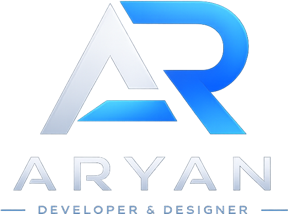

# 👋 Aryan Tyagi Portfolio

<p align="center">



</p>

<h2 align="center">
Shopify & WordPress Developer
</h2>

<p align="center">
Modern • Responsive • SEO Friendly • Conversion Focused Websites
</p>

---

## 🌐 Live Website

👉 https://portfolio-2c6.pages.dev/

---

# 🚀 About

This portfolio showcases my professional Shopify and WordPress development work.

It highlights live client projects, modern UI designs, responsive layouts, SEO-friendly websites and conversion-focused development.

---

# ✨ Features

- Responsive Design
- Shopify Development
- WordPress Development
- Elementor Websites
- Landing Pages
- Website Optimization
- FAQ Section
- Google Analytics
- Microsoft Clarity
- SEO Optimized
- Smooth Animations
- Resume Download

---

# 🛠 Tech Stack

- HTML5
- CSS3
- JavaScript
- Shopify
- WordPress
- Elementor
- Git
- GitHub

---

# 🌟 Featured Projects

| Project | Platform |
|---------|----------|
| Rover Inn | HTML/CSS/JS |
| Shandilya Hotels | WordPress |
| VINR | Shopify |
| Product Page World | WordPress |
| Traffic Media | WordPress |
| Jenco Decor | WordPress |
| Rashi Guru | Shopify |
| Shree Home Decor | Shopify |
| Ankshaktiyaan | WordPress |

---

# 📂 Folder Structure

```text
portfolio/
│
├── assets/
│   ├── images/
│   ├── icons/
│   └── resume/
│
├── index.html
├── style.css
├── navbar.css
├── about.css
├── services.css
├── projects.css
├── contact.css
├── footer.css
├── cursor.css
├── script.js
├── robots.txt
├── sitemap.xml
└── README.md
```

---

# 📬 Contact

📧 Email

> tyagiaryannda@gmail.com

💼 LinkedIn

> https://linkedin.com/in/aryan-tyagi-51640a218

💻 GitHub

> https://github.com/Aryan-Tyagi-Web

🌐 Portfolio

> https://portfolio-2c6.pages.dev/

---

# ⭐ If you like this project

Please consider giving it a ⭐ on GitHub.